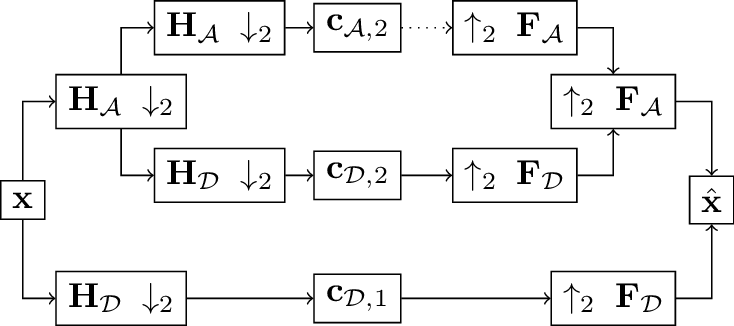
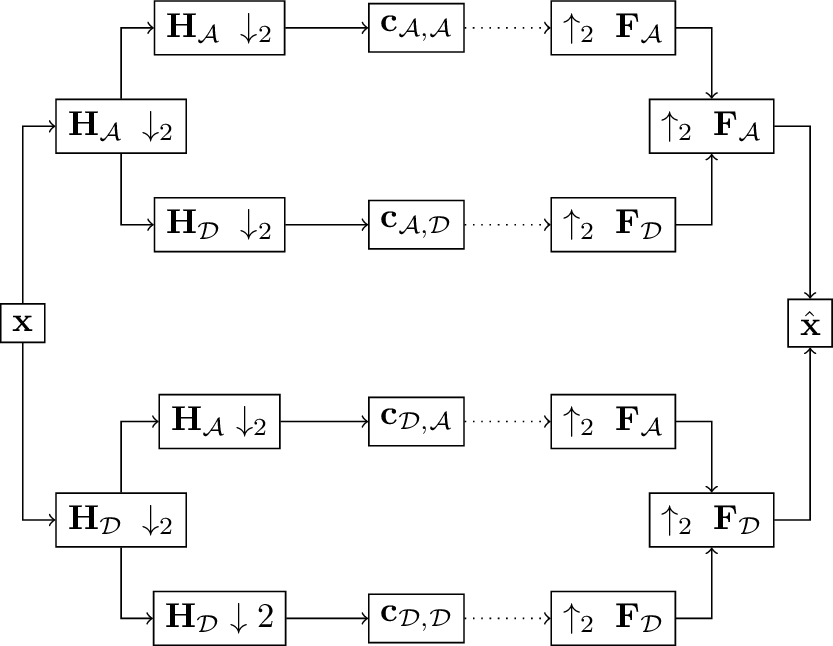
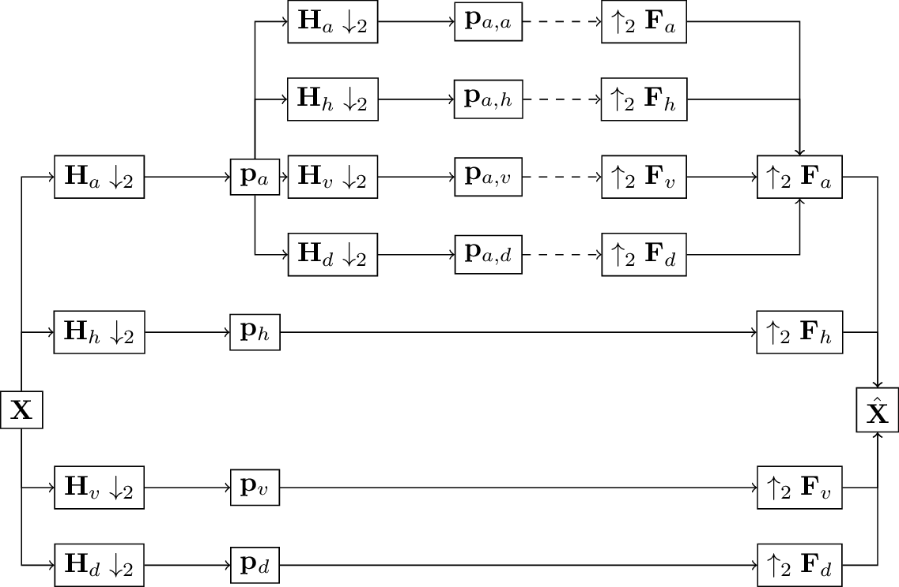
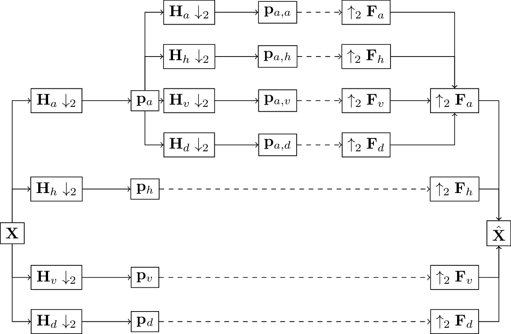
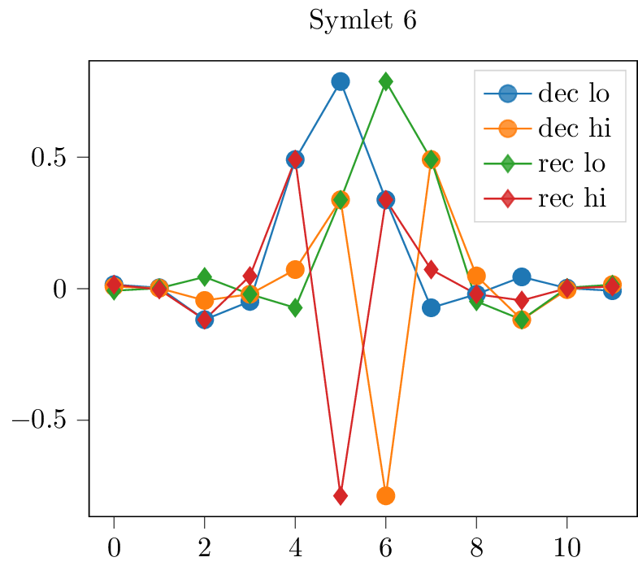
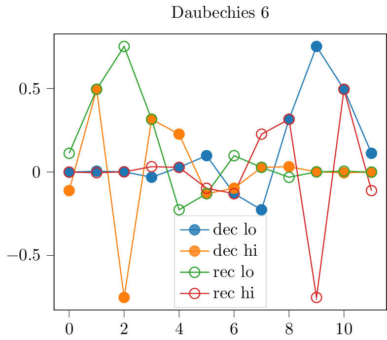

Introduction to discrete wavelet transforms
===========================================

This text summarizes key wavelet facts as a convenience for the hasty reader.
See, for example, :cite:`strang1996wavelets,mallat1999wavelet`
or :cite:`jensen2001ripples` for excellent detailed introductions to the topic.
This text is partially based material from :cite:`wolter2022wavelet`.

The fwt relies on convolution operations with filter pairs.

.. _fig-fwt:

   Overview of the fwt computation.

:numref:`fig-fwt` illustrates the process. :math:`\mathbf{h}_\mathcal{A}` denotes the analysis low-pass filter.
:math:`\mathbf{h}_\mathcal{D}` the analysis high pass filter.
:math:`\mathbf{f}_\mathcal{A}` and :math:`\mathbf{f}_\mathcal{D}` the synthesis filer pair.
:math:`\downarrow_2` denotes downsampling with a factor of two, :math:`\uparrow_2` means upsampling.
In machine learning terms, the analysis transform relies on stride two convolutions.
The synthesis or inverse transform on the right works with stride two transposed convolutions.
:math:`\mathbf{H}_{k}` and :math:`\mathbf{F}_{k}` with :math:`k \in [\mathcal{A}, \mathcal{D}]`
denote the corresponding convolution operators.

.. math::
  \mathbf{x}_s * \mathbf{h}_k = \mathbf{c}_{k, s+1}

with :math:`k \in [\mathcal{A}, \mathcal{D}]` and :math:`s \in \mathbb{N}_0` the set of natural numbers,
where :math:`\mathbf{x}_0` is equal to
the original input signal :math:`\mathbf{x}`. At higher scales, the fwt uses the low-pass filtered result as input,
:math:`\mathbf{x}_s = \mathbf{c}_{\mathcal{A}, s}` if :math:`s > 0`.
The dashed arrow indicates that we could continue to expand the fwt tree here.
:py:meth:`ptwt.conv_transform.wavedec` implements this transformation.
:py:meth:`ptwt.conv_transform.waverec` provides the inverse functionality visible
on the right side of Figure :numref:`fig-fwt`.

The wavelet packet transform (pwt) additionally expands the high-frequency part of the tree.
The figure below depicts the idea.

.. _fig-wpt:

   Scematic drawing of the full wpt in a single dimension. Compared to :numref:`fig-fwt`, the high-pass filtered side of the tree is expanded, too.

Whole expansion is not the only possible way to construct a wavelet packet tree.
See :cite:`jensen2001ripples` for a discussion of other options.
In :numref:`fig-fwt` and :numref:`fig-wpt`, capital letters denote convolution operators.
These may be expressed as Toeplitz matrices :cite:`strang1996wavelets`.
The matrix nature of these operators explains the capital boldface notation.
Coefficient subscripts record the path that leads to a particular coefficient.
:py:meth:`ptwt.packets.WaveletPacket` provides this functionality for single dimensional inputs.

.. _sec-fwt-2d:

The two-dimensional transform
-----------------------------

This toolbox provides two dimensional input processing functionality.
We construct filter quadruples from the original filter pairs to process two-dimensional inputs.
The process uses outer products :cite:`vyas2018multiscale`:

.. math::
    \mathbf{h}_{a} = \mathbf{h}_\mathcal{A}\mathbf{h}_\mathcal{A}^T,
    \mathbf{h}_{h} = \mathbf{h}_\mathcal{A}\mathbf{h}_\mathcal{D}^T,
    \mathbf{h}_{v} = \mathbf{h}_\mathcal{D}\mathbf{h}_\mathcal{A}^T,
    \mathbf{h}_{d} = \mathbf{h}_\mathcal{D}\mathbf{h}_\mathcal{D}^T

With :math:`a` for approximation, :math:`h` for horizontal,
:math:`v` for vertical, and :math:`d` for diagonal :cite:`lee2019pywavelets`.

With the four filters we are now able to compute,

.. math::
  \mathbf{x}_s *_2 \mathbf{h}_k = \mathbf{c}_{k, s+1}

with :math:`k \in [a, h, v, d]` and :math:`s \in \mathbb{N}_0` the set of natural numbers,
where :math:`\mathbf{x}_0` is equal to
the original input image :math:`\mathbf{X}`. :math:`*_2` indicates two dimensional-convolution.
Computations at subsequent scales work exclusively with approximation coefficients :math:`c_{a, s}` as inputs.
The figure below illustrates the process.

.. _fig-fwt2d:

   Two-dimensional wavelet transform computation diagram. :math:`\mathbf{X}` and :math:`\hat{\mathbf{X}}` denote input image and
   reconstruction respectively.

:py:meth:`ptwt.conv_transform_2.wavedec2` and :py:meth:`ptwt.conv_transform_2.waverec2` support forward
and backward transforms respectively. Potential further decomposition of all coefficient leads us to
wavelet packets.

.. _fig-wpt2d:

   Two-dimensional wavelet packet transform computation diagram. Dashed lines indicate potential full expansion of the tree.

:numref:`fig-wpt2d` illustrates the computation of a full two-dimensional wavelet packet tree.
At higher scales, all resulting coefficients from previous scales serve as inputs.
The four filters repeatedly convolved with all outputs to build the full tree. The inverse transforms work analogously.
:py:meth:`ptwt.packets.WaveletPacket2D` provides this functionality.
We refer to the standard literature :cite:`jensen2001ripples,strang1996wavelets` for an extended discussion.

Compared to the FWT, the high-frequency half of the tree is subdivided into more bins,
yielding a fine-grained view of the entire spectrum.
We always show analysis and synthesis transforms to stress that all wavelet transforms are lossless.
Synthesis transforms reconstruct the original input based on the results from the analysis transform.

Common wavelets and their properties
------------------------------------

A key property of the wavelet transform is its invertibility. Additionally, we expect an alias-free representation.
Standard literature like :cite:`strang1996wavelets` formulates the perfect reconstruction
and alias cancellation conditions to satisfy both requirements.
For an analysis filter coefficient vector :math:`\mathbf{h}`
the equations below use the polynomial :math:`H(z) = \sum_n h(n)z^{-n}`.
We construct :math:`F(z)` the same way using the synthesis filter coefficients in :math:`\mathbf{f}`.
To guarantee perfect reconstruction the filters must respect

.. math::
    H_\mathcal{A}(z)F_\mathcal{A}(z) + H_\mathcal{D}(-z)F_\mathcal{D}(z) = 2z^{-l}.

Similarly

.. _eq-alias:

.. math::
  F_\mathcal{A}(z)H_\mathcal{A}(-z) + F_\mathcal{D}(z)H_\mathcal{D}(-z) = 0

guarantees alias cancellation.

Filters that satisfy both equations qualify as wavelets. Lets consider i.e. a Daubechies wavelet and a Symlet:

.. _fig-sym6:

   Visualization of the Symlet 6 filter coefficients.

.. _fig-db6:

   Visualization of the Daubechies 6 filter coefficients.

:numref:`fig-sym6` and :numref:`fig-db6` visualize the Daubechies and Symlet filters of 6th degree.
Compared to the Daubechies Wavelet family, their Symlet cousins have more mass at the center.
:numref:`fig-sym6` illustrates this fact. Large deviations occur around the fifth filter in the center,
unlike the Daubechies' six filters in :numref:`fig-db6`.
Consider the sign patterns in :numref:`fig-db6`.
The decomposition highpass (orange) and the reconstruction lowpass (green) filters display an alternating sign pattern.
This behavior is a possible solution to the alias cancellation condition.
To understand why substitute :math:`F_\mathcal{A}(z) = H_\mathcal{D}(-z)` and :math:`F_\mathcal{D} = -H_\mathcal{A}(-z)`
into the perfect reconstruction condition :cite:`strang1996wavelets`.
:math:`F_\mathcal{A}(z) = H_\mathcal{D}(-z)` requires an opposing sign
at even and equal signs at odd powers of the polynomial.

