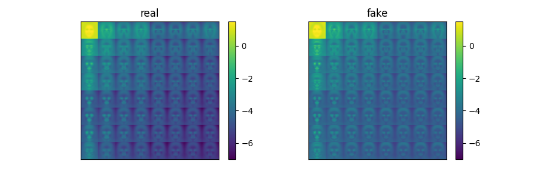
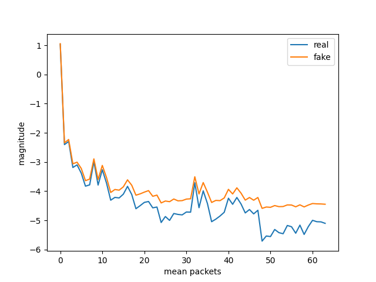

## Wavelet-Packets for deepfake analysis
This analysis considers 128 by 128-pixel images from [StyleGAN](https://github.com/NVlabs/stylegan) and [Flickr-Faces-HQ](https://github.com/NVlabs/ffhq-dataset).

Flickr-Faces-HQ images depict real people, such as the person below:


Generative adversarial networks allow the generation of fake images at scale. Does the picture below seem real? 


How can we identify the fake? Wavelet packets can help!



The plot above shows log-scaled mean absolute packet plots of 70k fake and real images each. The fakes tend to have more energy in high-frequency bands.





The second plot confirms the previous observation. Gan-generated images tend to produce different high-frequency packages. The higher-frequency packets appear on the left of the graph.

Recreating these experiments requires roughly 8GB of free disc space and 10GB of free RAM. 
To reproduce these plots:
1. Download [ffhq_style_gan.zip](https://drive.google.com/uc?id=1MOHKuEVqURfCKAN9dwp1o2tuR19OTQCF&export=download) and
2. Extract the image pairs here.
3. Check the file structure. In `ffhq_style_gan` the folder structure should be:
```
source_data
 ├── A_ffhq
 ├── B_stylegan
```
4. Run `python packet_plot.py`

You can read more about GAN-detection in the paper [Wavelet-Packets for Deepfake Image Analysis and Detection](https://rdcu.be/cUIRt). 
A complete project building gan-detectors on top of wavelets is available at:
https://github.com/gan-police/frequency-forensics
