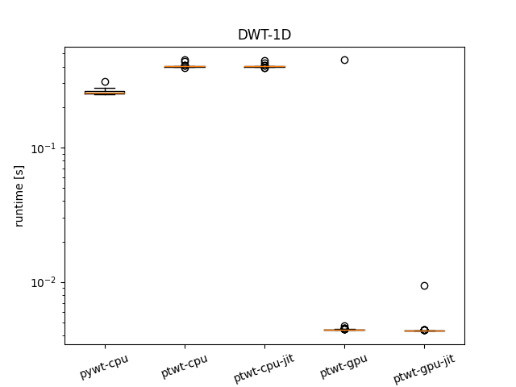
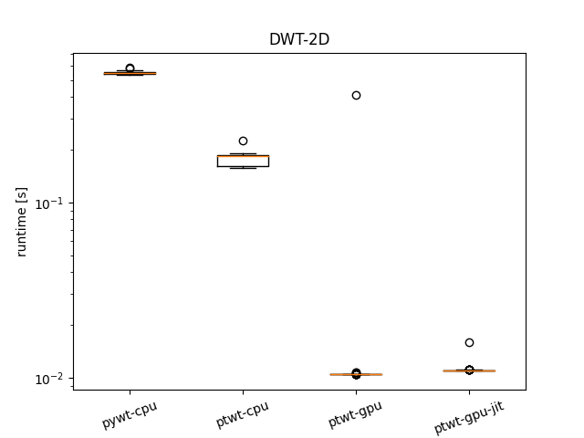
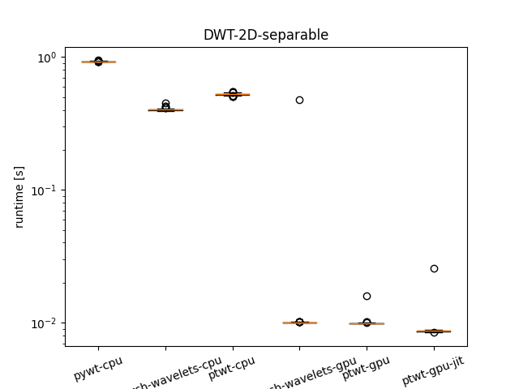
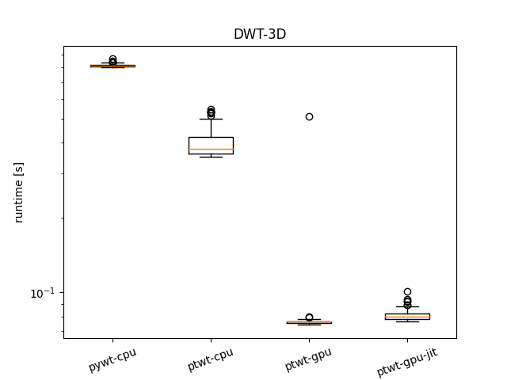
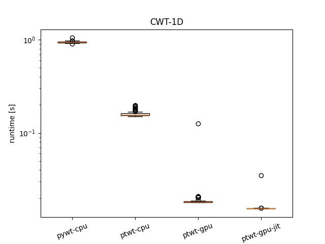

## Ptwt - Speed - Tests

To run the speed tests, install [pywt](https://pywavelets.readthedocs.io/en/latest/install.html) and [pytorch-wavelets](https://github.com/fbcotter/pytorch_wavelets) in addition to our ptwt.
The numbers below were measured using an NVIDIA RTX A4000 graphics card and an Intel(R) Xeon(R) W-2235 CPU @ 3.80GHz. We ship performant software. This readme lists our measurement results below. `run_all.sh` re-runs these tests on your machine.

### 1D-FWT

To execute the speed tests for the single-dimensional case run:
```bash
python timeitconv_1d.py
```
it produces the output and plot below:

```bash
1d-pywt-cpu    :0.25841 +- 0.00907
1d-ptwt-cpu    :0.40286 +- 0.00638
1d-ptwt-cpu-jit:0.40119 +- 0.00537
1d-ptwt-gpu    :0.00887 +- 0.04413
1d-ptwt-gpu-jit:0.00439 +- 0.00051

```

The 1d cython code from the pywt library does pretty well on our CPU. However, ptwt supports GPUs, which provide a speedup by several orders of magnitude.



### 2D-FWT

For the two-2d fast wavelet decomposition case run:
```bash
python timeitconv_2d.py
```
Result:
```bash
2d-pywt-cpu    :0.54936 +- 0.00924
2d-ptwt-cpu    :0.17453 +- 0.01335
2d-ptwt-gpu    :0.01447 +- 0.03995
2d-ptwt-gpu-jit:0.01110 +- 0.00050
```



### 2D-separable-FWT 

Separable transforms are also commonly implemented. Pytorch-wavelets does this see [2d-fwt-object](https://github.com/fbcotter/pytorch_wavelets/blob/9a0c507f04f43c5397e384bb6be8340169b2fd9a/pytorch_wavelets/dwt/transform2d.py#L70) and the [underlying implementation](https://github.com/fbcotter/pytorch_wavelets/blob/9a0c507f04f43c5397e384bb6be8340169b2fd9a/pytorch_wavelets/dwt/lowlevel.py#L312) . We study the performance with periodic padding below:

```bash
2d-pywt-cpu:0.92772 +- 0.00295
2d-pytorch_wavelets-cpu:0.40189 +- 0.00727
2d-pytorch_wavelets-gpu:0.01474 +- 0.04667
2d-ptwt-cpu    :0.52484 +- 0.00790
2d-ptwt-gpu    :0.00995 +- 0.00062
2d-ptwt-gpu-jit:0.00886 +- 0.00171
```





### 3D-FWT

Finally, use

```bash
python timeitconv_3d.py
```
for the three-dimensional case. It should produce something like the output below:

```bash
3d-pywt-cpu    :0.81744 +- 0.01047
3d-ptwt-cpu    :0.39827 +- 0.04912
3d-ptwt-gpu    :0.08047 +- 0.04310
3d-ptwt-gpu-jit:0.08096 +- 0.00410
```




### CWT

The last experiment in this example studies the cwt implementation.

Run:

```bash
python timeitcwt_1d.py
```
to reproduce the result. We observe:

```bash
cwt-pywt-cpu    :0.94439 +- 0.01742
cwt-ptwt-cpu    :0.16029 +- 0.00925
cwt-ptwt-gpu    :0.01957 +- 0.01081
cwt-ptwt-gpu-jit:0.01566 +- 0.00193
```
on our hardware.


