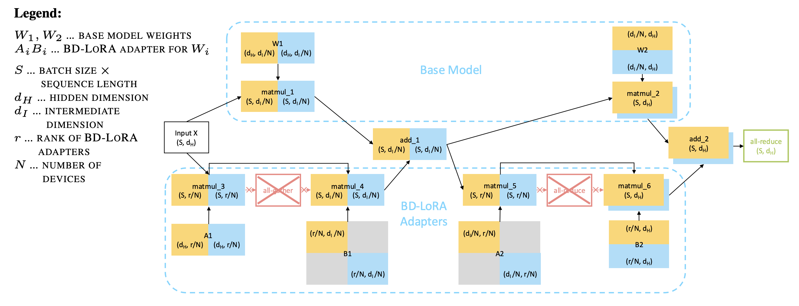

# Block-Diagonal LoRA for Eliminating Communication Overhead in Tensor Parallel LoRA Serving

## Introduction
Block-Diagonal LoRA (BD-LoRA) is a LoRA variant in which some LoRA factors are constrained to be block-diagonal. This allows faster serving by eliminating communication overheads 
when running inference on multiple GPUs. Despite the block-diagonal constraint, BD-LoRA is similarly performant to vanilla LoRA at similar parameter counts.

Following the [Megatron Sharding Strategy](https://arxiv.org/abs/1909.08053), for two linear layers that follow each other (e.g. up and down projection), we will shard the first layer in a column-parallel way (which requires LoRA B to be block-diagonal) and the second layer in a row-parallel way (which requires LoRA A to be block-diagonal). This sharding allows a compatible inference engine to distribute each block-diagonal shard over a a different GPU, cutting the need to communicate partial results among GPUs. In the image below, you can see our exact sharding strategy and how this saves computational efforts.

Paper: https://arxiv.org/html/2510.23346v1



## Quick Start
To use BD-LoRA, we can follow standard LoRA-training procedures. We only need to change the LoraConfig to a BD-LoRA config and specify which LoRA should be block-diagonal. For the following example, we will train a LLama-Model in such a way that it can later benefit from inference speed-up as specified in the BD-LoRA paper. 

In Llama, we need to think about how the attention and linear modules are sharded: attention consists of a QKV projection (in parallel) followed by an out projection, while the linear modules consist of parallel up and gate projections, followed by a down projection. Therefore, we want to shard the QKV, up and gate projections in a column-parallel manner (using a block-diagonal LoRA-B factor), and the down and out projections in a row-parallel manner (using a block-diagonal LoRA-A factor).

Additionally, we need to know on how many GPUs we want to serve before we start training, as this corresponds to the number of block we will use for each block-diagonal factor. For this experiment, we will use 2 blocks (equivalent to a tensor-parallelism degree of 2). Caveat: For a small model such as Llama 3.2-1B which we are using, one would use a single GPU for serving, and use TP=2 or TP=8 only for larger models, like Llama 3.1-8B or Llama 3.3-70B respectively. 
```python
from peft.tuners import BdLoraConfig, LoraConfig
from peft import get_peft_model
from transformers import Trainer, TrainingArguments, DataCollatorForLanguageModeling, AutoModelForCausalLM, AutoTokenizer
from datasets import load_dataset
import torch

model_name = "meta-llama/Llama-3.2-1B"
model = AutoModelForCausalLM.from_pretrained(model_name)
tokenizer = AutoTokenizer.from_pretrained(model_name)
bd_config = BdLoraConfig(
    r=16,
    # If you use a model different from Llama, change the settings below
    target_modules=["q_proj", "v_proj", "k_proj", "up_proj", "gate_proj", "o_proj", "down_proj"],
    lora_a_is_blockdiagonal=["o_proj", "down_proj"],
    lora_b_is_blockdiagonal=["q_proj", "v_proj", "k_proj", "up_proj", "gate_proj"],
    # Set this equal to the number of GPUs you want to serve the model with later
    nblocks=2,
    lora_bias=False
)
peft_model = get_peft_model(model, bd_config)

dataset = load_dataset("imdb", split="train[:1%]")

tokenizer.pad_token = tokenizer.eos_token
def tokenize(batch):
    return tokenizer(batch["text"], truncation=True, padding="max_length", max_length=128)

dataset = dataset.map(tokenize, batched=True, remove_columns=["text"])
training_args = TrainingArguments(
    output_dir="./results",
    per_device_train_batch_size=8,
    gradient_accumulation_steps=4,
    warmup_steps=2,
    max_steps=10,
    learning_rate=2e-4,
    logging_steps=1,
)

trainer = Trainer(
    model=peft_model,
    args=training_args,
    train_dataset=dataset,
    data_collator=DataCollatorForLanguageModeling(tokenizer, mlm=False),
)

peft_model.config.use_cache = False
trainer.train()
```

A ready-to-use notebook is also available at `bdlora_peft_demo.ipynb`.

## Usage in vLLM
[WIP]
To easily allow one to use BD-LoRA for practical inference speed-up, a PR is planned in vLLM that will make BD-LoRA adapters servable by using a single flag
during server start-up. Once the PR is merged and stable, further information and a usage example will be added.

## Citation
```
@misc{wang2025blockdiagonalloraeliminatingcommunication,
      title={Block-Diagonal LoRA for Eliminating Communication Overhead in Tensor Parallel LoRA Serving}, 
      author={Xinyu Wang and Jonas M. Kübler and Kailash Budhathoki and Yida Wang and Matthäus Kleindessner},
      year={2025},
      eprint={2510.23346},
      archivePrefix={arXiv},
      primaryClass={cs.LG},
      url={https://arxiv.org/abs/2510.23346}, 
}
```
