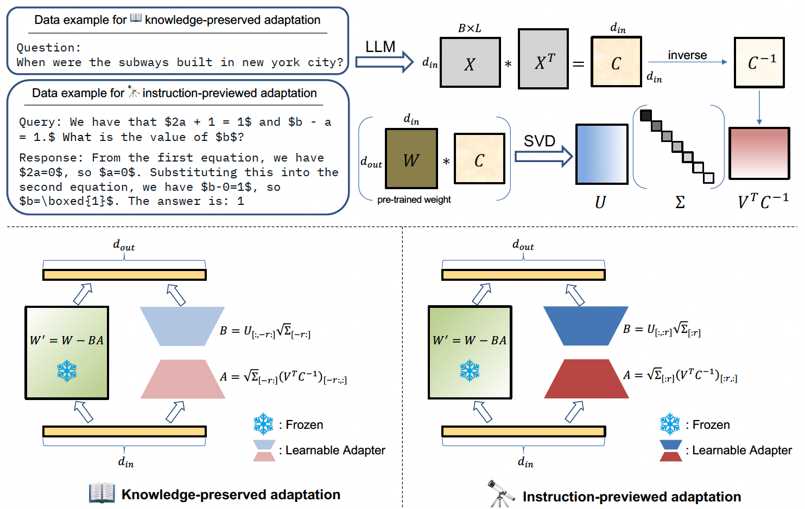

# CorDA: Context-Oriented Decomposition Adaptation of Large Language Models for Task-Aware Parameter-Efficient Fine-tuning 

**(NeurIPS 2024)**

Authors: [Yibo Yang](https://iboing.github.io/), Xiaojie Li, Zhongzhu Zhou, Shuaiwen Leon Song, [Jianlong Wu](https://jlwu1992.github.io/), [Liqiang Nie](https://liqiangnie.github.io/index.html), [Bernard Ghanem](http://www.bernardghanem.com/)

Paper: [[PDF](https://arxiv.org/pdf/2406.05223)]



---

## Getting Started

Download the repo and install dependencies. 

```
git clone https://github.com/huggingface/peft.git
cd peft/examples/corda_finetuning
pip install -r requirements.txt
```

The dataset in json/jsonl formats used to collect covariance matrices (MetaMath for math, CodeFeedback for code, WizardLM_evol_instruct and alpaca for instruction following) can be downloaded from our [huggingface repo](https://huggingface.co/collections/iboing/corda-66918a95105d80e9e131012f). The other datasets will be automatically downloaded when runing the code. 


## Step 1: Context-oriented Decomposition

You can skip Step 1 by directly downloading the decomposed model from our huggingface repo. 

Corda enables to initialize a learnable adapter in two modes, knowledge-preserved adaptation (`tools/build_KPA.sh`) and instruction-previewed adaptation (`tools/build_IPA.sh`). The knowledge-preserved adaptation samples questions from QA datasets, such as `triviaQA` and `nq_open`, to obtain covariance matrices for decomposition, and uses the smallest $r$ singular values and vectors to initialize the adapter. The instruction-previewed adaptation samples queries and responses from the finetuning dataset to obtain covariance matrices, and initialize the adapter with the larget $r$ singular values and vectors. 

### 📖 Knowledge-preserved adaptation

```bash
CUDA_VISIBLE_DEVICES=0 python build_corda.py \
    --model_id "meta-llama/Llama-2-7b-hf" \
    --r {rank} \
    --use_cache \
    --calib_dataset "nqopen" \
    --calib_loader_size 256 \
    --save_model \
    --save_path {path_to_decomposed_model}
```

**Arguments**:

- `--model_id` is the pre-trained model for decomposition.
- `--r` is the low rank of LoRA, e.g. 128.
- `--use_cache` adopts the dataloader and covariance matrices saved in `CorDA/cache`, to avoid calculating the covariance matrices again.
- `--calib_dataset` specifies the dataset to sample data to obtain covariance matrices. KPA mode uses QA datasets with choices of `"nqopen"` and `"traivia_qa"`.
- `--calib_loader_size` is the number of sampled data. 
- `--save_model` saves the initialized model in `--save_path`. 

### 🔭 Instruction-previewed adaptation

```bash
CUDA_VISIBLE_DEVICES=0 python build_corda.py \
    --model_id "meta-llama/Llama-2-7b-hf" \
    --r {rank} \
    --use_cache \
    --first_eigen \
    --calib_dataset "MetaMATH" \
    --calib_loader_size 256 \
    --save_model \
    --save_path {path_to_decomposed_model}
```

**Arguments**:

- `--first_eigen` uses the largest $r$ singular values and vectors to initialize the learnable adapter for the instruction-previewed adaptation mode. 
- `--calib_dataset` specifies the dataset to sample data to obtain covariance matrices. IPA mode uses finetuning datasets with choices of `"MetaMATH"`, `"codefeedback"`, `"WizLMinstruct"`, and `"alpaca"`.

## Step 2: Adapter Training

**LoRA**:

```
sh tools/train_LoRA.sh {path_to_trained_model}
```

**CorDA**:

```
sh tools/train_CorDA.sh {path_to_decomposed_model} {path_to_trained_model}
```

## Step 3: Inference

After training, LoRA adapter can be merged with the base model by runing:

```bash
python merge_adapter_to_base_model.py --base_model "meta-llama/Llama-2-7b-hf" --adapter {path_to_trained_model}/ft --output_path {path_to_merged_model}
```

CorDA adapter can be merged with the base model by runing:

```bash
python merge_adapter_to_base_model.py --base_model {path_to_decomposed_model} --adapter {path_to_trained_model}/ft --output_path {path_to_merged_model}
```

**Inference on world knowledge**:

Inference on world knowledge benchmarks is based on [EleutherAI/lm-evaluation-harness](https://github.com/EleutherAI/lm-evaluation-harness). For example, we evaluate on nq_open by:

```bash
accelerate launch -m lm_eval \
    --model hf \
    --model_args pretrained={path_to_trained_model}/ft,trust_remote_code=True,dtype=float16 \
    --output_path {result_path}/nq_open.json \
    --tasks nq_open \
    --batch_size auto \
    --max_batch_size 8 \
    --device cuda
```


**Inference on Math**:

Evaluation on Gsm8k and Math can be performed by:
```
(for CorDA:)
sh tools/inference_Math.sh {path_to_trained_model}/ft
(for LoRA:)
sh tools/inference_Math.sh {path_to_merged_model}
```

**Inference on Code and Instruction Following**:

Evaluation on HumanEval and MBPP is based on [bigcode-evaluation-harness](https://github.com/bigcode-project/bigcode-evaluation-harness). Evaluation on MTBench is based on [FastChat](https://github.com/lm-sys/FastChat). We use their default settings for evaluation. 


## Results

| Method | TriviaQA | NQ open | GSM8k | Math |
|---|---|---|---|---|
|LoRA|44.17|1.91|42.68|5.92|
|[CorDA (KPA with nqopen)](https://huggingface.co/iboing/CorDA_KPA_nqopen_finetuned_math/tree/main) | **45.23** | **10.44** | 45.64 | 6.94|
|[CorDA (IPA with MetaMath)](https://huggingface.co/iboing/CorDA_IPA_math_finetuned_math/tree/main) | - | - | **54.59** | **8.54** |

Compared with LoRA, CorDA in knowledge-preserved adaptation (KPA) not only has better performances on the finetuning task, but also helps to mitigate the forgetting of world knowledge. CorDA in instruction-previewed adaptation (IPA) enables to further enhance the finetuning performance.

The models can be downloaded from our [huggingface repo](https://huggingface.co/collections/iboing/corda-66918a95105d80e9e131012f). 


## Wikitext/PTB Results

To reproduce the Figure 2 and Table 6 of our paper to compare our context-oriented decomposition with ASVD and Plain SVD, you can execute `tools/full_decompose.sh`. Concretely, 
```bash
CUDA_VISIBLE_DEVICES=0 python -u build_corda.py \
    --model_id="meta-llama/Llama-2-7b-hf" \
    --r {the smallest rank to discard} \
    --mode full_decompose \
    --use_cache \
    --calib_dataset "wikitext2" \
    --calib_loader_size 256 \
    [--cov_aware for context-oriented decomposition, --act_aware for ASVD, or remove this argument for plain SVD]
```
**Arguments**:
- `--r` is the number of the smallest singular values and vectors to discard, i.e., the x-axis of Figure 2. 
- `--cov_aware` adopts our context-oriented SVD. Use `--act_aware` for ASVD or remove this argument for the Plain SVD. 

## Citation
If you find our work/code useful for your research, please consider citing:
```
@article{yang2024corda,
  title={CorDA: Context-Oriented Decomposition Adaptation of Large Language Models},
  author={Yang, Yibo and Li, Xiaojie and Zhou, Zhongzhu and Song, Shuaiwen Leon and Wu, Jianlong and Nie, Liqiang and Ghanem, Bernard},
  journal={arXiv preprint arXiv:2406.05223},
  year={2024}
}
```
